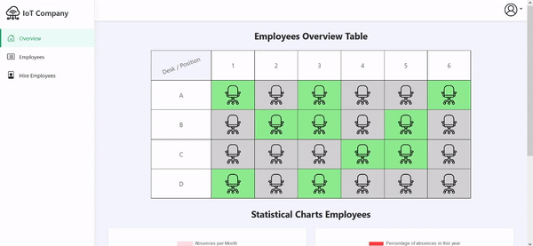
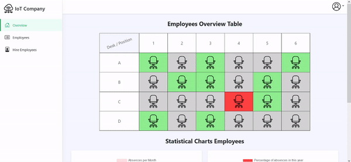
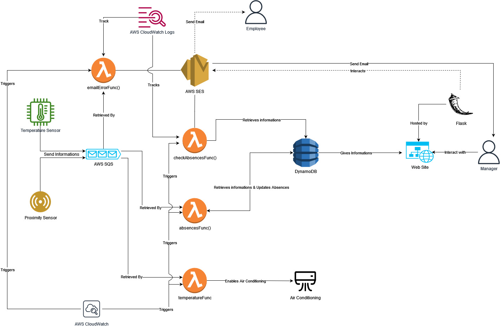

# IoT-Company
IoT Company is a smart company that helps the company manager to better supervise its employees.
## Info project
First name: *Simone* <br />
Last name: *Giglio* <br />
Registration number: *0522501292* <br />
# Index
* [Overview](#Overview)
* [Implementation Overview](#Implementation-Overview)
* [Architecture](#Architecture)
* [Prerequisites](#Prerequisites)
* [Setting up the environment](#Setting-up-the-environment)
* [Use it](#Use-it)
* [Future Improvement](#Future-Improvement)


# Overview
IoT Company is a smart company that helps the company manager to better supervise its employees.
With this platform the manager can see all the information about his employees, he can see their *data* (like *first and last name*, *email*, *role* and their *desk*), he can hire an employee (with which he has already had the work interview), and with these data he can manage his employees with a simple and intuitive UI.

After stored these informations, over all the year, the application is able to generate some charts that describe all the progress and the percentage about all the employees, also there are single charts that refer to the single employee, in order to see his statistics.

<div align="center">

</div>

We can see all the employees that are present in the day (with green color), the free desks (with grey color) and also the absent employees (with red color, if any), at last we can see also all the stats about all employees absences from the start of the year.

There are different services that the company offers:

- Every morning at 9:00 A.M. the company checks if there are absent employees or not with proximity sensors; if any, the absence is reported on the website with the red color:

<div align="center">

</div>

- Every hour from 9:00 A.M to 6:00 P.M. the company checks the temperature room to activate air conditioning or not;

- Every morning at 9:00 A.M. the company checks if there were a problem with the proximity sensor, if any, an email will be sent to the manager.

- Every month on the first day, the company checks the absences of all the employees in the previous, to do a recap and to make sure they have not exceeded the maximum allowed threshold. If the maximum allowed for an employee has been exceeded, an email will be sent to the manager.


# Implementation Overview
There are two kind of IoT sensors:
* There are **proximity sensors placed in each desk:** they measure whether an employee has shown up for work or not.
  * Every morning with the *absencesFunc* lambda function, the sensors send messages to the relative queue containing the employees presence/absence and the website is updated to show a complete overview.
  * The function is triggered every morning and it checks the *proximity* queue, related to all the desks, to see if there are any messages to process.
  * The *emailErrorFunc* lambda function is triggered when a message arrives in the *errors* queue. This function sends an email to the manager of the company notifying him about the errors detected by the sensor.
* There is a **temperature sensors placed in the room:** they measure the `temperature` in the room.
  * This sensor every hour measures the temperature in the room and send a message to the relative queue containing the temperature in that moment.
  * The *temperatureFunc* lambda function is triggered when a message arrives in the *temperature* queue. This function turn on the air conditioning in cold mode if it's cold, in hot mode if it is hot, otherwise is shown a message indicating the optimum temperature.
  * The function takes the old and the new version of the Item modified and enables the air condition if the temperature is too high. 
* There is also an another lambda function, that is called *checkAbsencesFunc*, this function is trigged every month on the first day, it interact with database, retrieving all the informations about the employees, to make sure they have not exceeded the maximum allowed threshold. If the maximum allowed for an employee has been exceeded, an email will be sent to the manager.


## Architecture

<div align="center">

</div>

* **Cloud environment:** Using [LocalStack](https://localstack.cloud/) to simulate AWS Services;
* **Flask:** [Flask](https://flask.palletsprojects.com/en/2.1.x/) is a web framework written in Python, it provide a Web server which allows the use of Python as backend developing;
* **IoT devices:** Simulated with a Python function using [boto3](https://boto3.amazonaws.com/v1/documentation/api/latest/guide/quickstart.html) Python Library to send/receive messages on the queues;
* **AWS SQS:** [Amazon Simple Queue Service (SQS)](https://aws.amazon.com/sqs/) is a distributed message queuing service provided by Amazon AWS;
* **AWS Lambda:** [AWS Lambda](https://aws.amazon.com/lambda/) is a event-driven compute servicethat allows developer to run code without managing servers (serverless functions);
* **AWS DynamoDB:** [Amazon DynamoDB](https://aws.amazon.com/dynamodb/) is the database, it's a fully managed NoSQL database service provided by Amazon AWS;
* **AWS CloudWatch:**  ([Amazon CloudWatch](https://aws.amazon.com/cloudwatch/)) implements the rule, which and when invokes the serverless functions;
    * **CloudWatch Logs:**  in particular [CloudWatch Logs](https://docs.aws.amazon.com/AmazonCloudWatch/latest/logs/WhatIsCloudWatchLogs.html) which helps to monitoring the sent emails with log files;
* **AWS SES:** [AWS Simple Email Service (SES)](https://aws.amazon.com/it/ses/)) is a service provided by Amazon AWS and it's used to send emails. 

### Prerequisites
1. [Docker](https://docs.docker.com/get-docker/)
2. [AWS CLI](https://docs.aws.amazon.com/cli/latest/userguide/getting-started-install.html)
3. [boto3](https://boto3.amazonaws.com/v1/documentation/api/latest/guide/quickstart.html)
4. [Flask](https://flask.palletsprojects.com/en/2.1.x/)
5. [NodeJs](https://nodejs.org/it/)(Optional) for database visualization on localhost.

### Setting up the environment

**1. Clone the repository to download all the required files:**

```bash
git clone https://github.com/sgiglio11/IoT-Company.git
```

**2. Open a console and launch LocalStack:**

```bash
docker run --rm -it -p 4566:4566 -p 4571:4571 localstack/localstack
```

**3. Create an SQS queue for each desk:**

```bash
aws sqs create-queue --queue-name proximity --endpoint-url=http://localhost:4566

aws sqs create-queue --queue-name temperature --endpoint-url=http://localhost:4566

aws sqs create-queue --queue-name errors --endpoint-url=http://localhost:4566
```

and check that the queues are correctly created:

```bash
aws sqs list-queues --endpoint-url=http://localhost:4566
```

**4. Open a new console and create the DynamoDB tables and populate them:**

Use the python code to create and populate the DynamoDB tables:
```bash
python3 codes/populateDB.py
```

and after check if they are correctly created:

```bash
aws dynamodb list-tables --endpoint-url=http://localhost:4566
```

You can check that the table are correctly populated using the dynamodb-admin GUI:

Set the dynamo endpoint:
```bash
DYNAMO_ENDPOINT=http://0.0.0.0:4566 dynamodb-admin
```
and run the dynamodb-admin GUI:
```bash
dynamodb-admin
```

and then going to http://localhost:8001
> You need to open an another console.

You also need to verify your email identity in order to send/receive emails with AWS SES:
```bash
aws ses verify-email-identity --email-address root@root.it --endpoint-url=http://localhost:4566

aws ses verify-email-identity --email-address sender@example.it --endpoint-url=http://localhost:4566
```

**5. Create the time-triggered Lambda function to elaborate the data**

Create the role policy:
```bash
aws iam create-role --role-name lambdarole --assume-role-policy-document file://code/role_policy.json --query 'Role.Arn' --endpoint-url=http://localhost:4566
```

Attach the policy:
```bash
aws iam put-role-policy --role-name lambdarole --policy-name lambdapolicy --policy-document file://code/policy.json --endpoint-url=http://localhost:4566
```

Create zip files containing all the needed lamda functions' resources:
```bash
zip absencesFunc.zip codes/absencesFunc.py

zip temperatureFunc.zip codes/temperatureFunc.py

zip checkAbsencesFunc.zip codes/checkAbsencesFunc.py codes/CONFIG.py

zip emailErrorFunc.zip codes/emailErrorFunc.py codes/CONFIG.py
```

Create the function and save the Arn (it should be something like <code>arn:aws:lambda:us-east-2:000000000000:function:updateUserFunc</code>

```bash
aws lambda create-function --function-name absencesFunc --zip-file fileb://absencesFunc.zip --handler codes/absencesFunc.lambda_handler --runtime python3.6 --role arn:aws:iam::000000000000:role/lambdarole --endpoint-url=http://localhost:4566

aws lambda create-function --function-name temperatureFunc --zip-file fileb://temperatureFunc.zip --handler codes/temperatureFunc.lambda_handler --runtime python3.6 --role arn:aws:iam::000000000000:role/lambdarole --endpoint-url=http://localhost:4566

aws lambda create-function --function-name checkAbsencesFunc --zip-file fileb://checkAbsencesFunc.zip --handler codes/checkAbsencesFunc.lambda_handler --runtime python3.6 --role arn:aws:iam::000000000000:role/lambdarole --endpoint-url=http://localhost:4566

aws lambda create-function --function-name emailErrorFunc --zip-file fileb://emailErrorFunc.zip --handler codes/emailErrorFunc.lambda_handler --runtime python3.6 --role arn:aws:iam::000000000000:role/lambdarole --endpoint-url=http://localhost:4566
```

> if you want to delete the lambda functions, digit this:
```bash
aws lambda delete-function --function-name absencesFunc --endpoint-url=http://localhost:4566

aws lambda delete-function --function-name temperatureFunc --endpoint-url=http://localhost:4566

aws lambda delete-function --function-name checkAbsencesFunc --endpoint-url=http://localhost:4566

aws lambda delete-function --function-name emailErrorFunc --endpoint-url=http://localhost:4566
```

**6. Set up CloudWatch rules to trigger the Lambda functions:**

Creare the rule and save the Arn (it should be something like `arn:aws:events:us-east-2:000000000000:rule/<name_function>`)
```bash
aws events put-rule --name everyDay --schedule-expression 'cron(0 9 * * ? *)' --endpoint-url http://localhost:4566

aws events put-rule --name everyMonth --schedule-expression 'cron(0 0 1 * *)' --endpoint-url http://localhost:4566

aws events put-rule --name everyHourInTheDay --schedule-expression 'cron(0 9-18 ? * * *)' --endpoint-url http://localhost:4566
```
and check that the rules are correctly created:

```bash
aws events list-rules --endpoint-url=http://localhost:4566
```

Add lambda functions to the rule permission:
```bash
aws lambda add-permission --function-name absencesFunc --statement-id everyDay --action 'lambda:InvokeFunction' --principal events.amazonaws.com --source-arn arn:aws:events:us-east-2:000000000000:rule/absencesFunc --endpoint-url=http://localhost:4566

aws lambda add-permission --function-name temperatureFunc --statement-id everyHourInTheDay --action 'lambda:InvokeFunction' --principal events.amazonaws.com --source-arn arn:aws:events:us-east-2:000000000000:rule/temperatureFunc --endpoint-url=http://localhost:4566

aws lambda add-permission --function-name checkAbsencesFunc --statement-id everyMonth --action 'lambda:InvokeFunction' --principal events.amazonaws.com --source-arn arn:aws:events:us-east-2:000000000000:rule/checkAbsencesFunc --endpoint-url=http://localhost:4566

aws lambda add-permission --function-name emailErrorFunc --statement-id everyDay --action 'lambda:InvokeFunction' --principal events.amazonaws.com --source-arn arn:aws:events:us-east-2:000000000000:rule/emailErrorFunc --endpoint-url=http://localhost:4566
```

Add the lambda function to the rule using the JSON file containing the Lambda function Arn
```bash
aws events put-targets --rule everyDay --targets file://codes/absences_targets.json --endpoint-url=http://localhost:4566

aws events put-targets --rule everyHourInTheDay --targets file://codes/temperature_targets.json --endpoint-url=http://localhost:4566

aws events put-targets --rule everyMonth --targets file://codes/checkAbsences_targets.json --endpoint-url=http://localhost:4566

aws events put-targets --rule everyDay --targets file://codes/emailError_targets.json --endpoint-url=http://localhost:4566
```

To check the logs about the sent emails, run this command:
```bash
aws logs get-log-events --log-group-name EmployeeAbsences --log-stream-name EmailSent --endpoint-url=http://localhost:4566

aws logs get-log-events --log-group-name EmailError --log-stream-name EmailSent --endpoint-url=http://localhost:4566
```

## Use it
Simulate the IoT devices
```bash
python3 codes/proximity-IoT-sensor.py

python3 codes/temperature-IoT-sensor.py
```

Modify the variable `FLASK_KEY` within the `CONFIG.py` with a random string.

Modify the variable `EMAIL_MANAGER` within the `CONFIG.py` with a random email.

Modify the variable `EMAIL_PROTOTYPE` within the `CONFIG.py` with a random email.

Run Flask with the command:
```bash
python3 app.py
```

Go to the website and see the new informations

#### Future Improvements

* **Adding Rooms**: Adding the possibility to see differents employees in differents rooms, for bigger companies.
* **Adding roles in the website page**: The possibility to signup for the employees and managers with differents user interfaces based for the role person.
* **Adding new serverless function**: The possibility to adding new functionalities to the platform in order to improve it.